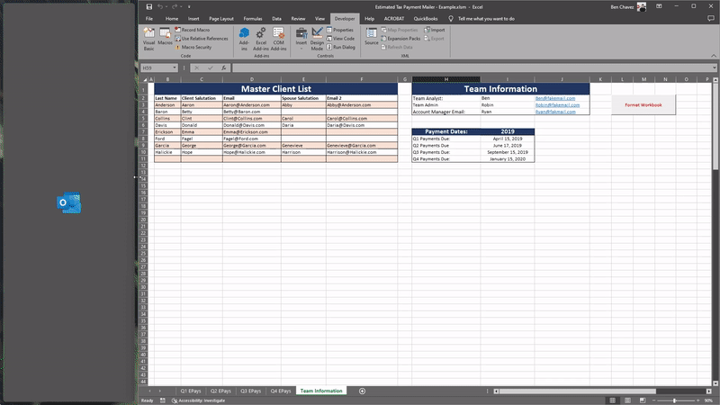

# Estimated Tax Payment Mailer

<ins>**Description**</ins>:

This workbook allows a financial planning team to easily keep track of estimated tax payments and to generate automated quarterly emails to clients.

<ins>**Set Up:**</ins>

1. Open a new workbook to the “Team Information” tab and make sure that the following information is accurate:

   1. Team Information
   2. Year (`cell I7`) and Payment dates

2. Fill in the Master Client List beginning in `cell B3` with information on each of your team’s clients.

3. Once all of your clients are added to the Master Client List, click the `Format Workbook` button in `cell L3` of the `Team Information` tab. Running this macro will update each `EPAY` tab with your client list. **Note that if you run this macro on an existing workbook it will remove any formatting (including highlighting) in the workbook**. For this reason, it is recommended that if you wish to color code your workbook that you do it in `column A` as this will not be impacted by the formatting macro.

<ins>**Generating Email Drafts:**</ins>

1.  In order to generate client email drafts, click on the `Generate EPAY Drafts` button. All email
    drafts will be saved in your Microsoft Outlook Drafts Folder. **BE SURE TO REVIEW EMAIL DRAFTS
    FOR ERRORS BEFORE SENDING**. Note, this program will operate differently depending on the
    information in `column C`. Please see below for further clarification:

      1.  <ins>**PDF**</ins>:
          Email is generated in the Outlook Drafts Folder. The Team Analyst will then have to generate the individual pdf’s and attach them to each generated email. This can be done immediately.

      2.  <ins>**GS - Neg. Consent**</ins> \:
          Email to client is generated in the Microsoft Outlook Drafts Folder. The Team Analyst
          will need to generate a separate email to CSG with the specifics of each check that is
          being requested. It is advised that the analyst CC the team admin on their email to CSG.
          Since this is a negative consent email, all steps may be completed immediately, unless
          the client directs otherwise.

          Since this is a negative consent email, all steps may be completed immediately, unless the client directs otherwise.

      3.  <ins>**GS - Pos. Consent**</ins>:
          Email to client is generated in the Microsoft Outlook Drafts Folder. The Team Analyst
          will need to generate a separate email to CSG with the specifics of each check that is
          being requested. It is advised that the analyst CC the team admin on their email to CSG.

          Since this is a positive consent email, no further action should be taken until the client

      4.  <ins>**Voucher**</ins>:
          An email to the team admin requesting the preparation of estimated payment vouchers
          is generated in the Microsoft Outlook Drafts Folder.
